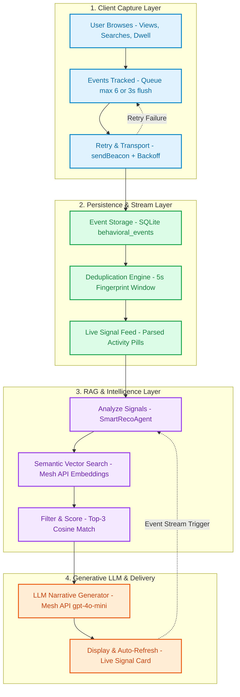

# SmartReco: System Architecture & Whimsical Diagram Spec

This document details the refined, simplified, and high-performance system architecture for **SmartReco / NeuroCart**. It includes visual diagrams, internal technical specifications, and a direct blueprint for building this layout in **Whimsical** or **Mermaid**.

---

## 🎨 1. Whimsical Visual Layout (4-Lane Structure)

Organize your Whimsical canvas into 4 visual lanes using standard Whimsical card colors:

```
┌──────────────────────────────────────────────────────────────────────────────────────────────────┐
│  LANE 1: CLIENT CAPTURE (Color: Light Blue)                                                     │
│                                                                                                  │
│  [User Browses]  ───────►  [Events Tracked]  ───────►  [Retry Logic & Transport]                  │
│  • Views & Searches         • Queue (Max 6)             • Exponential Backoff                    │
│  • Dwell Timer              • Flush (3000ms)            • sendBeacon / fetch                     │
└──────────────────────────────────────────────────────────────────────────────────────────────────┘
                                      │
                                      ▼
┌──────────────────────────────────────────────────────────────────────────────────────────────────┐
│  LANE 2: EVENT PERSISTENCE & STREAM (Color: Light Green)                                         │
│                                                                                                  │
│  [Event Storage] ───────►  [Deduplication Engine] ───►  [Live Signal Feed]                       │
│  • SQLite WAL Mode          • Hash Window (5 sec)       • Action Pills                           │
│  • behavioral_events        • Unique User Fingerprint   • "Dwell · 12s on Agentic AI"             │
└──────────────────────────────────────────────────────────────────────────────────────────────────┘
                                      │
                                      ▼
┌──────────────────────────────────────────────────────────────────────────────────────────────────┐
│  LANE 3: INTELLIGENCE & VECTOR RAG (Color: Purple)                                               │
│                                                                                                  │
│  [Signal Analyzer] ──────►  [Semantic Search]     ───►  [Top-K Filter & Ranker]                   │
│  • Extract Tokens           • Mesh API Vector Embeds    • Cosine Similarity                      │
│  • Signal Aggregator        • Catalog Index Search      • Select Top 2-3 Courses                 │
└──────────────────────────────────────────────────────────────────────────────────────────────────┘
                                      │
                                      ▼
┌──────────────────────────────────────────────────────────────────────────────────────────────────┐
│  LANE 4: GENERATIVE & DELIVERY (Color: Peach / Coral)                                            │
│                                                                                                  │
│  [LLM Mesh API Engine] ──────►  [Display & Auto-Refresh]                                         │
│  • openai/gpt-4o-mini           • Floating Signal Widget                                         │
│  • Persuasive Narrative         • Real-Time Rec Feed Stream                                      │
└──────────────────────────────────────────────────────────────────────────────────────────────────┘
```

---

## 📊 2. Full Architecture Flow Diagram (Mermaid)



---

## 🛠️ 3. Node-by-Node Technical Details Matrix

| Node Name | Component File | Key Technical Details | Input / Payload | Output / State |
| :--- | :--- | :--- | :--- | :--- |
| **User Browses** | `tracker.js` | Captures clicks, page views, search inputs, and dwell duration. | User actions | Raw event queue |
| **Events Tracked** | `tracker.js` | Buffer queue (flushes every 3000ms or 6 items). | In-memory array | JSON payload |
| **Retry Logic** | `tracker.js` | Exponential backoff with jitter on network drop (`sendBeacon`). | HTTP 5xx / Drop | Retried fetch call |
| **Event Storage** | `app/database.py` | SQLite DB in WAL mode (`behavioral_events` table). | JSON event batch | Saved DB record ID |
| **Deduplication** | `app/database.py` | Hashes `(user_id, event_type, target_id, timestamp/5)`. | DB Row | Filtered stream |
| **Live Signal Feed** | `app/agent.py` | Formats events into pills (e.g. `Viewed · MLOps`, `Dwell · 12s`). | Event list | Parsed pill array |
| **Analyze Events** | `app/agent.py` | Extracts high-intent search terms and longest dwell items. | Pill list | Signal query text |
| **Semantic Search** | `app/vector_store.py` | Dense vector embedding search & cosine distance calculation. | Signal query string | Ranked candidate list |
| **Top-K Filter** | `app/agent.py` | Selects top 2-3 most relevant course items. | Candidates | Filtered 2-3 courses |
| **LLM (Mesh API)** | `app/agent.py` | OpenAI SDK connected to `https://api.meshapi.ai/v1`. | Context Prompt | 1-2 sentence story |
| **Store & Cache Rec** | `app/database.py` | Saves to `recommendations` table & updates `_RECOMMENDATION_CACHE`. | Rec dict | Stored rec ID |
| **Display & Refresh** | Frontend UI | Floating card update & recommendation list re-render. | API JSON response | Dynamic HTML UI |

---

## ⚡ 4. Internal Code & Algorithm Specifications

### A. Queue & Transport (`tracker.js`)
```javascript
// Batching & Flush Logic
const MAX_QUEUE_SIZE = 6;
const FLUSH_INTERVAL_MS = 3000;

function enqueueEvent(eventType, targetId, metadata = {}) {
    eventQueue.push({
        event_type: eventType,
        target_id: targetId,
        metadata_json: JSON.stringify(metadata),
        timestamp: new Date().toISOString()
    });
    if (eventQueue.length >= MAX_QUEUE_SIZE) flushEvents();
}
```

### B. Similarity Scoring Formula
$$\text{Similarity}(q, p) = \frac{\vec{E}(q) \cdot \vec{E}(p)}{\|\vec{E}(q)\| \|\vec{E}(p)\|}$$
* Where $\vec{E}(q)$ is the vector embedding of user active signals, and $\vec{E}(p)$ is the course embedding.

### C. Mesh API Gateway Request
* **Endpoint**: `POST https://api.meshapi.ai/v1/chat/completions`
* **Headers**: `Authorization: Bearer MESH_API_KEY`
* **Payload**:
  ```json
  {
    "model": "openai/gpt-4o-mini",
    "messages": [
      {"role": "system", "content": "You are NeuroCart's agentic recommendation engine."},
      {"role": "user", "content": "User live activity signals: Searched 'LangGraph' Dwell 12s on Agentic AI..."}
    ],
    "max_tokens": 150,
    "temperature": 0.7
  }
  ```

---

## 💡 Summary of System Improvements
1. **Asynchronous Non-Blocking Tracking**: Guaranteed smooth page navigation with `sendBeacon`.
2. **Double Caching Layer**: Avoids duplicate LLM API fees using event-hash caching.
3. **Resilient Fallback Copywriter**: Instant template response if Mesh API times out.
4. **4-Lane Logical Structure**: Simplifies complex distributed flows into clear operational stages.
